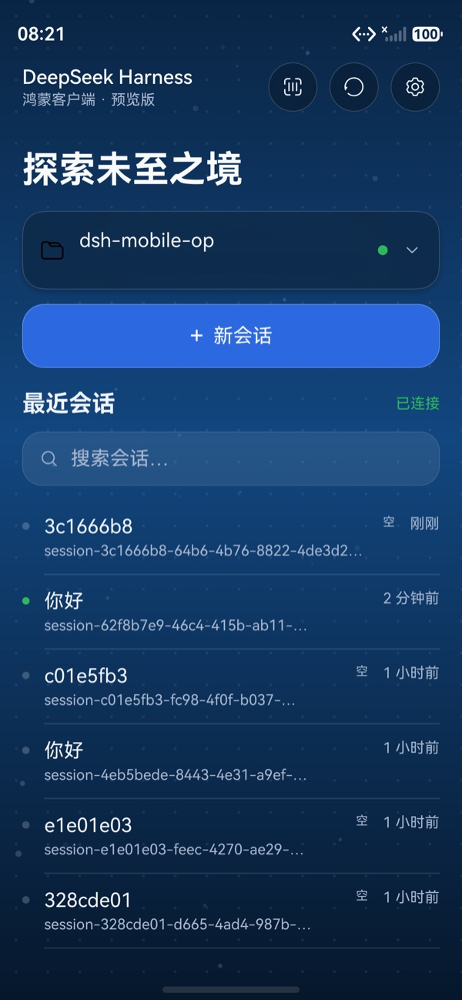
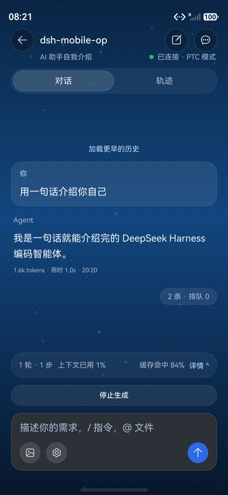
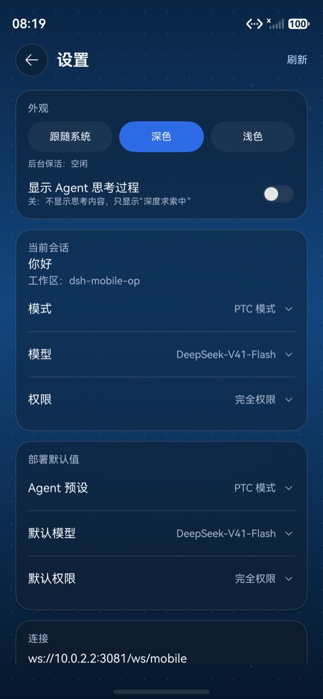

# DshMobile (HarmonyOS)

> 简体中文: [README.md](README.md)

A **native HarmonyOS client** (ArkTS + ArkUI, Stage model) for DeepSeek Harness, speaking the
`dsh-mobile-v1` protocol (`hello.protocol = 3`) over the third-party gateway
[`dsh-plugin-mobile-gateway`](https://github.com/Clarklevis1995/dsh-plugin-mobile-gateway).

- Protocol contract: [`docs/PROTOCOL.md`](docs/PROTOCOL.md) (upstream v0.7.2, verbatim copy)
- Upstream sibling clients (iOS / Android, KMP): [`Clarklevis1995/dsh-mobile`](https://github.com/Clarklevis1995/dsh-mobile)
- This repository is an independent HarmonyOS implementation; no upstream source is copied.
  See [`NOTICE`](NOTICE).

## Screenshots

| Home | Conversation | Settings |
|---|---|---|
|  |  |  |

## Requirements

| Item | Version (tested) |
|---|---|
| DevEco Studio | 26.0.0.821 |
| HarmonyOS SDK | API 26 (`/Applications/DevEco-Studio.app/Contents/sdk`) |
| Target | `targetSdkVersion 6.1.1(24)` / `compatibleSdkVersion 5.0.0(12)` |
| CLI | `devecocli` 1.3.0-stable (gateway side needs v0.7.2+) |

## Build & run

```bash
devecocli device list                            # start an emulator or connect a device first
devecocli emulator start "Pura 90"
devecocli signature generate --product default   # first time only (device connected + devecocli auth login)
devecocli build --build-mode debug
devecocli run --device 127.0.0.1:5555
devecocli check lint
```

Unit tests (`devecocli` has no `test` subcommand; use DevEco's bundled hvigor and run it from the
project root):

```bash
node /Applications/DevEco-Studio.app/Contents/tools/hvigor/bin/hvigorw.js test
```

## Signing & distribution

This repository ships **no signing material** (`signingConfigs` has been removed from
`build-profile.json5`). Configure signing locally before the first build:

```bash
devecocli signature generate --product default   # device connected + devecocli auth login
# or in DevEco Studio: Project Structure -> Signing Configs -> auto sign
```

For local / specified-device installs (no AppGallery release), use a **debug certificate + debug
Profile**:

- `hdc install` only accepts **debug-signed** packages. A release package signed with an AGC
  **release certificate** fails locally with `INSTALL_FAILED_APP_SOURCE_NOT_TRUSTED`.
- A debug Profile is **device-bound**: to install on someone else's phone you must add that
  device's **UDID** to your debug Profile, sign manually, and hand them the HAP to `hdc install`
  (or install it via DevEco Testing).
- Quotas: at most 3 debug certificates per account; at most 100 Profiles per app.

> The least-friction option is to **distribute source only**, and let each user sign with their
> own Huawei account.

## Gateway setup (host side)

```bash
# enable the mobile gateway (the WebUI "Mobile devices" panel works too)
curl -s -X POST http://127.0.0.1:3080/mgw/gateway -H 'content-type: application/json' -d '{"enabled":true}'
# issue a one-time pairing code: Base64URL in qrPayload; payload is a JSON object; 5-min TTL, single use
curl -s -X POST http://127.0.0.1:3080/mgw/pair -H 'content-type: application/json' \
  -d '{"name":"harmony","publicUrl":"ws://10.0.2.2:3081/ws/mobile"}'
```

From the emulator the host is always at `10.0.2.2` (QEMU slirp) — **do not use `127.0.0.1`**.

## Protocol probe

`tools/probe.mjs` is a Node reference client (it runs the same requests as the ArkTS client and
compares `requestId` correlation and `seq` de-duplication frame by frame):

```bash
cd tools && ln -sfn ~/.dsh/profiles/web/node_modules/ws node_modules/ws
node probe.mjs pair --url ws://127.0.0.1:3080/ws/mobile --code <pairingCode>
node probe.mjs run  --url ws://127.0.0.1:3080/ws/mobile
```

## UI design

The interface follows the upstream client's design language (`dsh-mobile`'s
`Design/design-spec.md`, `DshTheme.kt`, `DshLiquidGlass.kt` and screenshots): deep navy gradient
plus a technical dot grid, sparingly used frosted glass, an ocean-blue primary action, and
tabular figures.

- Colours, layout and information architecture follow upstream; the **launcher icon** uses the
  upstream `AppIcon` whale artwork (MIT, see [`NOTICE`](NOTICE)).
- ArkUI counterparts: `common/HarnessBackground.ets` (gradient + dot grid),
  `views/MessageContent.ets` (Markdown subset renderer), `common/Format.ets` (segmenting and
  relative time; pure logic with unit tests).

## Directory layout

```
entry/src/main/ets/
├─ protocol/    protocol DTOs, wire decoding, strict Base64URL pairing payload
├─ gateway/     request lanes / RequestTracker (single receive loop) / dual-channel WebSocket client
├─ auth/        device id, long-lived token storage, preferences
├─ projection/  conversation & trajectory projections
├─ sync/        history pagination + live tail merge
├─ store/       GatewayStore (read-only UI snapshot + intents)
├─ pages/       Pairing / Workspace / Conversation / Settings
└─ views/       reusable UI components
```

## Status

The MVP is verified end-to-end on the emulator (HarmonyOS 6.1.1 / API 24): pairing → dual-channel
connection → workspace/session lists → history + live conversation → send message → new session →
credential persistence and automatic reconnect.

- Stage-0 protocol findings: `docs/spikes/2026-09-10-stage0-protocol-findings.md`
- Unit tests: `entry/src/test/` (170 cases: decoding, strict Base64URL, lanes/timeouts/dedupe,
  history merge, conversation projection, pagination, stats).

## Known constraints

- HarmonyOS NEXT only (API 12+). For HarmonyOS 4.x and below, use the upstream Android APK.
- Client JSON frame budget: 3.5 MB (measured on OHOS: 4 MB passes, 6 MB fails) — see `docs/spikes/`.
- Plain `ws://` needs no network-security configuration (official FAQ `faqs-network-16`).
